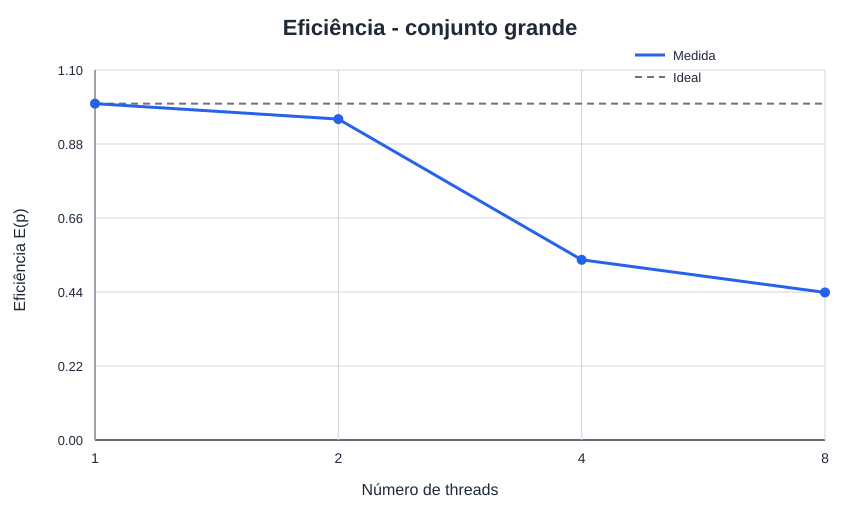
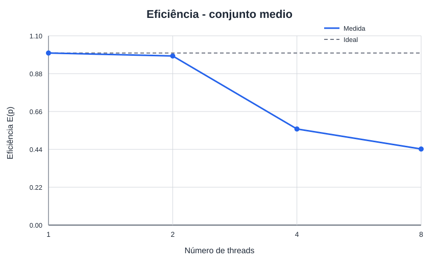
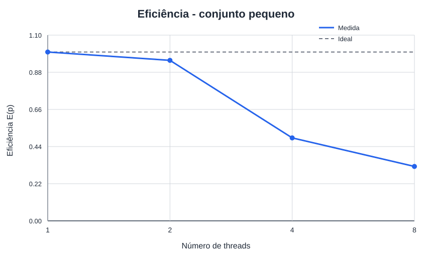
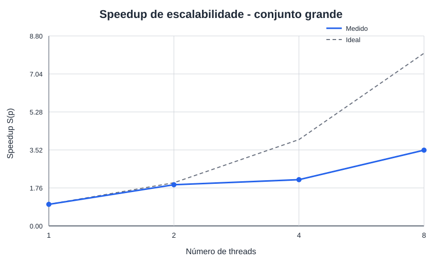
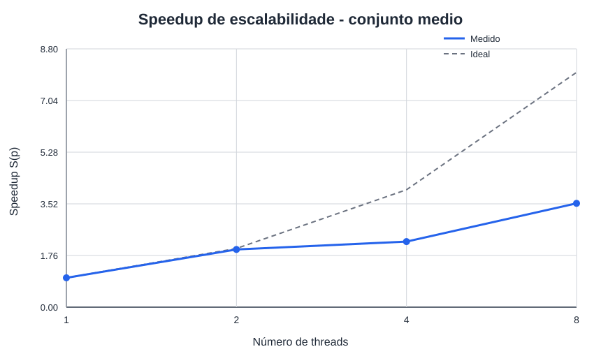
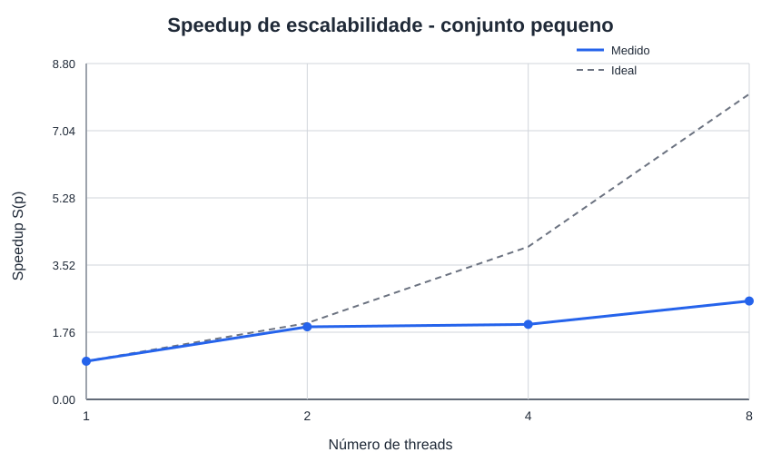

# Resultados dos experimentos locais

Gerado automaticamente em `2026-09-16T16:12:17-03:00`.

## Como ler este documento

Este relatório organiza as evidências já coletadas. Ele não executa o AG, não altera CSVs e não infere causas de desempenho. Use os links para voltar aos dados brutos antes de redigir a análise ou os slides.

## Inventário da coleta

- Tempos brutos: [dados/tempos.csv](dados/tempos.csv).
- Resumo de medianas: [dados/resumo.csv](dados/resumo.csv).
- Registros de ambiente: [dados/ambiente_primeiros_testes.md](dados/ambiente_primeiros_testes.md), [dados/tempos_ambiente.md](dados/tempos_ambiente.md).

## Ambiente de execução

Resumo baseado em [dados/tempos_ambiente.md](dados/tempos_ambiente.md).

| Campo | Valor |
| --- | --- |
| Data e hora | `2026-09-16T15:52:38-03:00` |
| Host | `leonardo-Inspiron-15-3530` |
| Sistema operacional | Ubuntu 24.04.4 LTS |
| Kernel | `Linux 7.0.0-30-generic x86_64 GNU/Linux` |
| Modelo | 13th Gen Intel(R) Core(TM) i7-1355U |
| Núcleos físicos | 10 |
| CPUs lógicas totais | 12 |
| CPUs lógicas disponíveis ao processo | 12 |
| Compilador | `gcc (Ubuntu 13.3.0-6ubuntu2~24.04.1) 13.3.0` |
| Flags sequenciais | `-O2 -g -std=c11 -Wall -Wextra -Wpedantic -Iinclude` |
| Flags paralelas | `-O2 -g -std=c11 -Wall -Wextra -Wpedantic -fopenmp -Iinclude` |
| Afinidade usada pelo coletor | `OMP_DYNAMIC=FALSE`, `OMP_PROC_BIND=true`, `OMP_PLACES=cores` |
| Uptime e média de carga | ` 15:52:38 up 11 min,  1 user,  load average: 2,70, 1,63, 0,88` |

## Configurações testadas

| Entrada | População | Bits | Gerações | Mutação | Seed |
| --- | --- | --- | --- | --- | --- |
| grande | 4000 | 2000 | 100 | 0.0005 | 42 |
| medio | 2000 | 2000 | 100 | 0.0005 | 42 |
| pequeno | 1000 | 1000 | 100 | 0.001 | 42 |

## Tempos, speedup e eficiência

`S(p) = Tpar(1) / Tpar(p)` mede a escalabilidade da versão paralela. `E(p) = S(p) / p`. `Tseq/Tpar(p)` é mostrado separadamente como comparação com a versão sequencial. Os tempos são medianas em segundos.

| Entrada | Threads | Tseq (s) | Tpar(1) (s) | Tpar(p) (s) | S(p) | E(p) | Tseq/Tpar(p) | n seq | n par |
| --- | --- | --- | --- | --- | --- | --- | --- | --- | --- |
| grande | 1 | 3.263738 | 3.240877 | 3.240877 | 1.000× | 100.0% | 1.007× | 10 | 10 |
| grande | 2 | 3.263738 | 3.240877 | 1.698456 | 1.908× | 95.4% | 1.922× | 10 | 10 |
| grande | 4 | 3.263738 | 3.240877 | 1.512536 | 2.143× | 53.6% | 2.158× | 10 | 10 |
| grande | 8 | 3.263738 | 3.240877 | 0.923539 | 3.509× | 43.9% | 3.534× | 10 | 10 |
| medio | 1 | 1.641126 | 1.633117 | 1.633117 | 1.000× | 100.0% | 1.005× | 10 | 10 |
| medio | 2 | 1.641126 | 1.633117 | 0.830814 | 1.966× | 98.3% | 1.975× | 10 | 10 |
| medio | 4 | 1.641126 | 1.633117 | 0.731076 | 2.234× | 55.8% | 2.245× | 10 | 10 |
| medio | 8 | 1.641126 | 1.633117 | 0.461730 | 3.537× | 44.2% | 3.554× | 10 | 10 |
| pequeno | 1 | 0.411563 | 0.402325 | 0.402325 | 1.000× | 100.0% | 1.023× | 10 | 10 |
| pequeno | 2 | 0.411563 | 0.402325 | 0.211602 | 1.901× | 95.1% | 1.945× | 10 | 10 |
| pequeno | 4 | 0.411563 | 0.402325 | 0.204699 | 1.965× | 49.1% | 2.011× | 10 | 10 |
| pequeno | 8 | 0.411563 | 0.402325 | 0.156072 | 2.578× | 32.2% | 2.637× | 10 | 10 |

### Destaques numéricos

- `grande`: maior speedup observado foi 3.509× com `p=8` (eficiência 43.9%).
- `medio`: maior speedup observado foi 3.537× com `p=8` (eficiência 44.2%).
- `pequeno`: maior speedup observado foi 2.578× com `p=8` (eficiência 32.2%).

## Integridade observada

Foram lidas 150 execuções brutas (`paralelizado`: 120, `sequencial`: 30).

A tabela confere se todas as repetições de uma mesma configuração registraram o mesmo melhor fitness. `DIVERGENTE` deve ser investigado antes de usar uma curva como comparação de desempenho.

| Configuração | Linhas | Versões | Fitness observado |
| --- | --- | --- | --- |
| entrada=grande, P=4000, B=2000, G=100, μ=0.0005, seed=42 | 50 | paralelizado, sequencial | 1575 (consistente) |
| entrada=medio, P=2000, B=2000, G=100, μ=0.0005, seed=42 | 50 | paralelizado, sequencial | 1522 (consistente) |
| entrada=pequeno, P=1000, B=1000, G=100, μ=0.001, seed=42 | 50 | paralelizado, sequencial | 847 (consistente) |

## Gráficos gerados

As figuras abaixo são as evidências visuais produzidas pela automação. Os valores numéricos de referência permanecem na tabela e no CSV acima.

### Eficiencia grande

[Eficiencia grande](graficos/eficiencia_grande.svg)

### Eficiencia medio

[Eficiencia medio](graficos/eficiencia_medio.svg)

### Eficiencia pequeno

[Eficiencia pequeno](graficos/eficiencia_pequeno.svg)

### Speedup grande

[Speedup grande](graficos/speedup_grande.svg)

### Speedup medio

[Speedup medio](graficos/speedup_medio.svg)

### Speedup pequeno

[Speedup pequeno](graficos/speedup_pequeno.svg)

## Roteiro para a análise crítica e os slides

- Compare apenas pontos do mesmo ambiente e da mesma configuração de entrada.
- Explique a tendência de `S(p)` e `E(p)` ao aumentar `p`, usando tempos, topologia da máquina e a carga registrada como evidências.
- Discuta separadamente `Tseq/Tpar(p)` e o speedup de escalabilidade `S(p)`, pois as referências são diferentes.
- Se houver VTune, relacione hotspots, sincronização e métricas de memória com uma observação específica das curvas, sem tratar o tempo instrumentado como referência.
- Registre limitações: tamanho do problema, repetições, afinidade, carga concorrente e possíveis pontos com fitness divergente.

## Como atualizar

Após uma nova coleta, gere novamente `dados/resumo.csv` e os gráficos. Em seguida, execute o script de relatório desta pasta para sobrescrever somente este Markdown.
