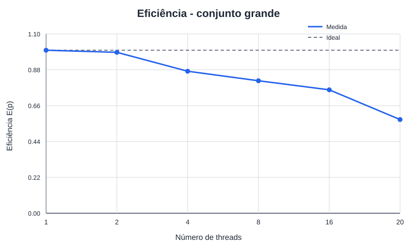
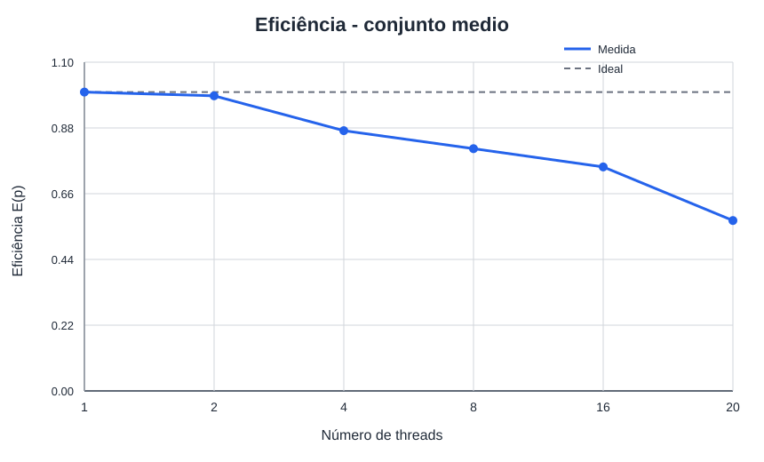
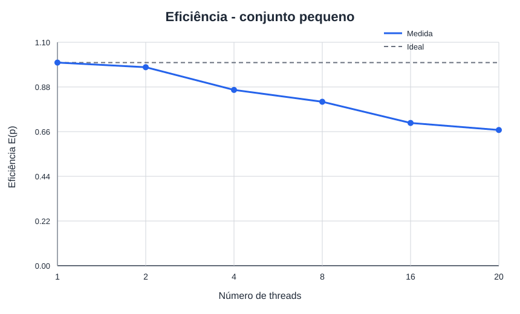
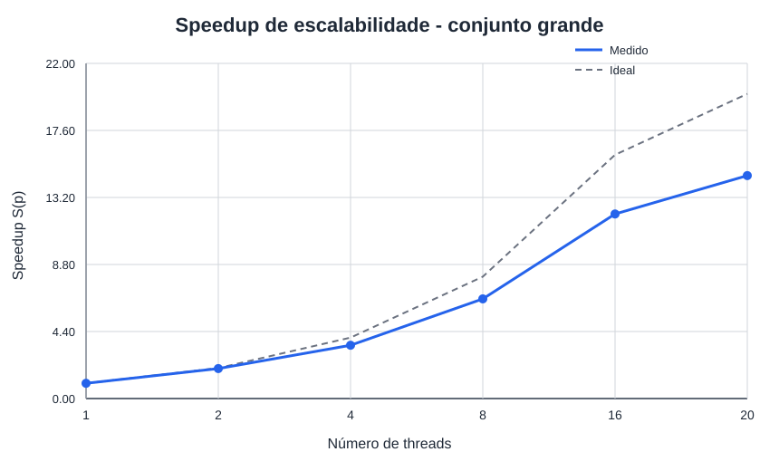
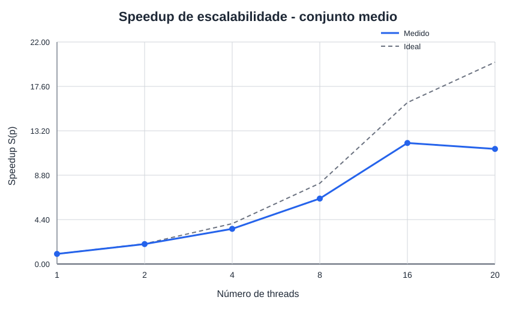
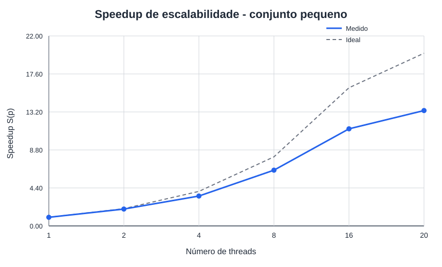

# Resultados dos experimentos na Hype

Gerado automaticamente em `2026-09-17T15:21:17-03:00`.

## Como ler este documento

Este relatório organiza as evidências já coletadas. Ele não executa o AG, não altera CSVs e não infere causas de desempenho. Use os links para voltar aos dados brutos antes de redigir a análise ou os slides.

## Inventário da coleta

- Tempos brutos: [dados/tempos.csv](dados/tempos.csv).
- Resumo de medianas: [dados/resumo.csv](dados/resumo.csv).
- Registros de ambiente: [dados/tempos_ambiente.md](dados/tempos_ambiente.md).

## Ambiente de execução

Resumo baseado em [dados/tempos_ambiente.md](dados/tempos_ambiente.md).

| Campo | Valor |
| --- | --- |
| Data e hora | `2026-09-17T15:02:35-03:00` |
| Host | `hype2` |
| Sistema operacional | Debian GNU/Linux 12 (bookworm) |
| Kernel | `Linux 6.1.0-45-amd64 x86_64 GNU/Linux` |
| Modelo | Intel(R) Xeon(R) CPU E5-2650 v3 @ 2.30GHz |
| Núcleos físicos | 20 |
| CPUs lógicas totais | 40 |
| CPUs lógicas disponíveis ao processo | 40 |
| Compilador | `gcc (Debian 12.2.0-14+deb12u1) 12.2.0` |
| Flags sequenciais | `-O2 -g -std=c11 -Wall -Wextra -Wpedantic -Iinclude` |
| Flags paralelas | `-O2 -g -std=c11 -Wall -Wextra -Wpedantic -fopenmp -Iinclude` |
| Afinidade usada pelo coletor | `OMP_DYNAMIC=FALSE`, `OMP_PROC_BIND=true`, `OMP_PLACES=cores` |
| Uptime e média de carga | ` 15:02:35 up 138 days, 14:19,  1 user,  load average: 3.91, 1.64, 1.17` |

## Configurações testadas

| Entrada | População | Bits | Gerações | Mutação | Seed |
| --- | --- | --- | --- | --- | --- |
| grande | 4000 | 2000 | 100 | 0.0005 | 42 |
| medio | 2000 | 2000 | 100 | 0.0005 | 42 |
| pequeno | 1000 | 1000 | 100 | 0.001 | 42 |

## Tempos, speedup e eficiência

`S(p) = Tpar(1) / Tpar(p)` mede a escalabilidade da versão paralela. `E(p) = S(p) / p`. `Tseq/Tpar(p)` é mostrado separadamente como comparação com a versão sequencial. Os tempos são medianas em segundos.

| Entrada | Threads | Tseq (s) | Tpar(1) (s) | Tpar(p) (s) | S(p) | E(p) | Tseq/Tpar(p) | n seq | n par |
| --- | --- | --- | --- | --- | --- | --- | --- | --- | --- |
| grande | 1 | 3.568084 | 3.547283 | 3.547283 | 1.000× | 100.0% | 1.006× | 10 | 10 |
| grande | 2 | 3.568084 | 3.547283 | 1.802328 | 1.968× | 98.4% | 1.980× | 10 | 10 |
| grande | 4 | 3.568084 | 3.547283 | 1.013961 | 3.498× | 87.5% | 3.519× | 10 | 10 |
| grande | 8 | 3.568084 | 3.547283 | 0.542153 | 6.543× | 81.8% | 6.581× | 10 | 10 |
| grande | 16 | 3.568084 | 3.547283 | 0.292798 | 12.115× | 75.7% | 12.186× | 10 | 10 |
| grande | 20 | 3.568084 | 3.547283 | 0.242368 | 14.636× | 73.2% | 14.722× | 10 | 10 |
| medio | 1 | 1.792537 | 1.773529 | 1.773529 | 1.000× | 100.0% | 1.011× | 10 | 10 |
| medio | 2 | 1.792537 | 1.773529 | 0.905177 | 1.959× | 98.0% | 1.980× | 10 | 10 |
| medio | 4 | 1.792537 | 1.773529 | 0.507984 | 3.491× | 87.3% | 3.529× | 10 | 10 |
| medio | 8 | 1.792537 | 1.773529 | 0.272583 | 6.506× | 81.3% | 6.576× | 10 | 10 |
| medio | 16 | 1.792537 | 1.773529 | 0.148932 | 11.908× | 74.4% | 12.036× | 10 | 10 |
| medio | 20 | 1.792537 | 1.773529 | 0.123578 | 14.352× | 71.8% | 14.505× | 10 | 10 |
| pequeno | 1 | 0.462991 | 0.447454 | 0.447454 | 1.000× | 100.0% | 1.035× | 10 | 10 |
| pequeno | 2 | 0.462991 | 0.447454 | 0.228954 | 1.954× | 97.7% | 2.022× | 10 | 10 |
| pequeno | 4 | 0.462991 | 0.447454 | 0.129264 | 3.462× | 86.5% | 3.582× | 10 | 10 |
| pequeno | 8 | 0.462991 | 0.447454 | 0.069300 | 6.457× | 80.7% | 6.681× | 10 | 10 |
| pequeno | 16 | 0.462991 | 0.447454 | 0.039795 | 11.244× | 70.3% | 11.634× | 10 | 10 |
| pequeno | 20 | 0.462991 | 0.447454 | 0.033489 | 13.361× | 66.8% | 13.825× | 10 | 10 |

### Destaques numéricos

- `grande`: maior speedup observado foi 14.636× com `p=20` (eficiência 73.2%).
- `medio`: maior speedup observado foi 14.352× com `p=20` (eficiência 71.8%).
- `pequeno`: maior speedup observado foi 13.361× com `p=20` (eficiência 66.8%).

## Integridade observada

Foram lidas 210 execuções brutas (`paralelizado`: 180, `sequencial`: 30).

A tabela confere se todas as repetições de uma mesma configuração registraram o mesmo melhor fitness. `DIVERGENTE` deve ser investigado antes de usar uma curva como comparação de desempenho.

| Configuração | Linhas | Versões | Fitness observado |
| --- | --- | --- | --- |
| entrada=grande, P=4000, B=2000, G=100, μ=0.0005, seed=42 | 70 | paralelizado, sequencial | 1575 (consistente) |
| entrada=medio, P=2000, B=2000, G=100, μ=0.0005, seed=42 | 70 | paralelizado, sequencial | 1522 (consistente) |
| entrada=pequeno, P=1000, B=1000, G=100, μ=0.001, seed=42 | 70 | paralelizado, sequencial | 847 (consistente) |

## Gráficos gerados

As figuras abaixo são as evidências visuais produzidas pela automação. Os valores numéricos de referência permanecem na tabela e no CSV acima.

### Eficiencia grande

[Eficiencia grande](graficos/eficiencia_grande.svg)

### Eficiencia medio

[Eficiencia medio](graficos/eficiencia_medio.svg)

### Eficiencia pequeno

[Eficiencia pequeno](graficos/eficiencia_pequeno.svg)

### Speedup grande

[Speedup grande](graficos/speedup_grande.svg)

### Speedup medio

[Speedup medio](graficos/speedup_medio.svg)

### Speedup pequeno

[Speedup pequeno](graficos/speedup_pequeno.svg)

## Evidências do Intel VTune Profiler

Cada bloco preserva os artefatos coletados para uma execução. Os trechos são apenas um índice de leitura: consulte o arquivo completo e compare com os tempos sem instrumentação antes de interpretar uma causa.

### `20260917_150435_grande_p8_g500`

**Coleta sem perfil utilizável.** O VTune registrou um erro antes de produzir relatórios de desempenho. Não use este diretório para atribuir hotspots ou causas à curva de speedup.

- [vtune/resultados/20260917_150435_grande_p8_g500/hotspots-bad/data.0/pinerr.tpsslog](vtune/resultados/20260917_150435_grande_p8_g500/hotspots-bad/data.0/pinerr.tpsslog): `Source/pin/elfio/img_elf.cpp: ProcessSectionHeaders: 927: unknown section type 0x13 for sec[51,.relr.dyn] in /lib64/ld-linux-x86-64.so.2`

Arquivos disponíveis: [vtune/resultados/20260917_150435_grande_p8_g500/metadados.md](vtune/resultados/20260917_150435_grande_p8_g500/metadados.md), [vtune/resultados/20260917_150435_grande_p8_g500/ambiente.md](vtune/resultados/20260917_150435_grande_p8_g500/ambiente.md).

## Roteiro para a análise crítica e os slides

- Compare apenas pontos do mesmo ambiente e da mesma configuração de entrada.
- Explique a tendência de `S(p)` e `E(p)` ao aumentar `p`, usando tempos, topologia da máquina e a carga registrada como evidências.
- Discuta separadamente `Tseq/Tpar(p)` e o speedup de escalabilidade `S(p)`, pois as referências são diferentes.
- Se houver VTune, relacione hotspots, sincronização e métricas de memória com uma observação específica das curvas, sem tratar o tempo instrumentado como referência.
- Registre limitações: tamanho do problema, repetições, afinidade, carga concorrente e possíveis pontos com fitness divergente.

## Como atualizar

Após uma nova coleta, gere novamente `dados/resumo.csv` e os gráficos. Em seguida, execute o script de relatório desta pasta para sobrescrever somente este Markdown.
