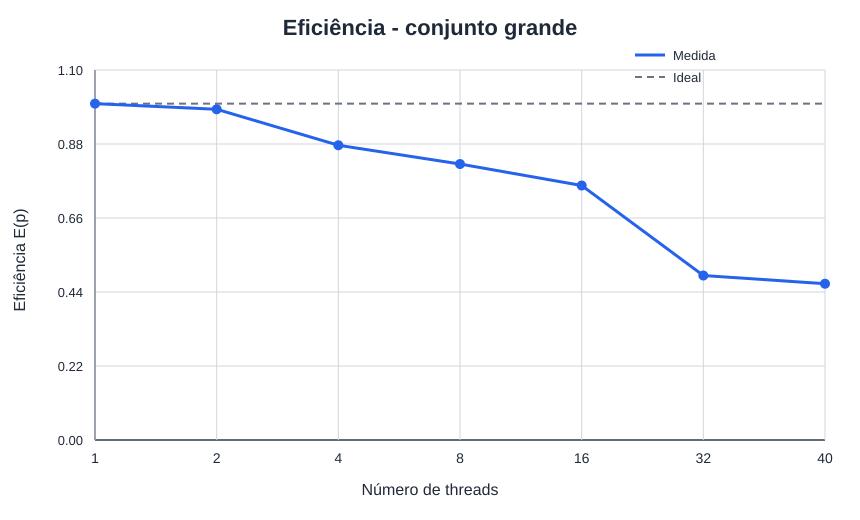
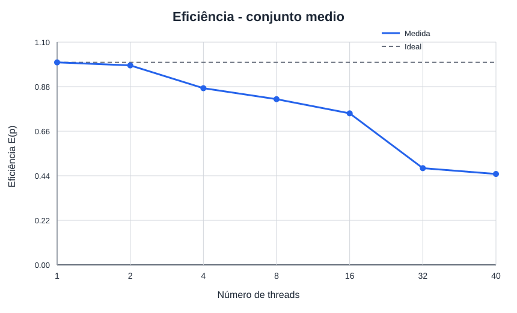
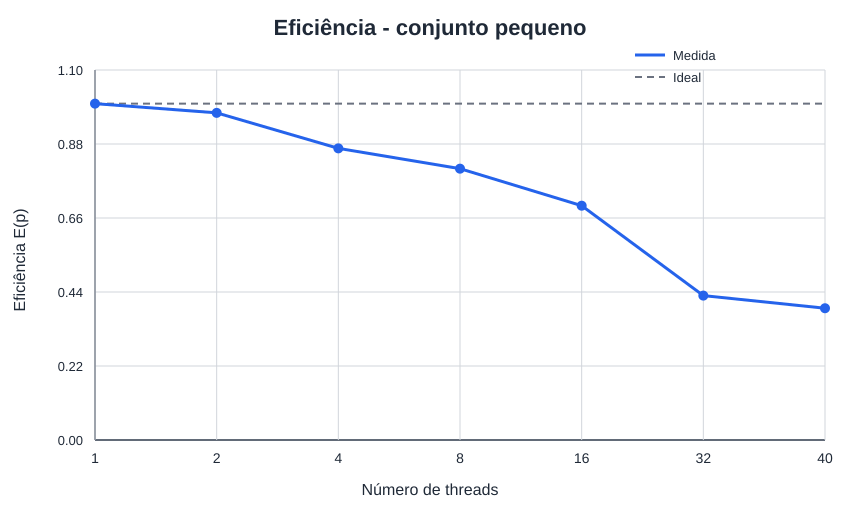
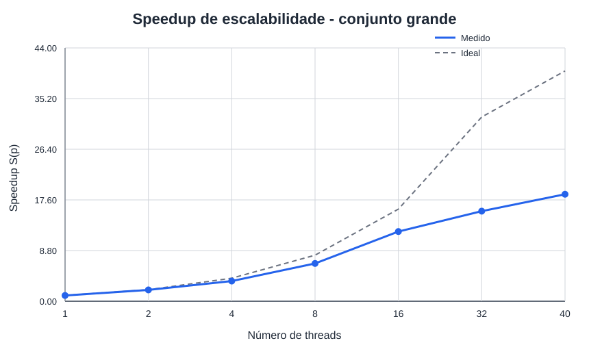
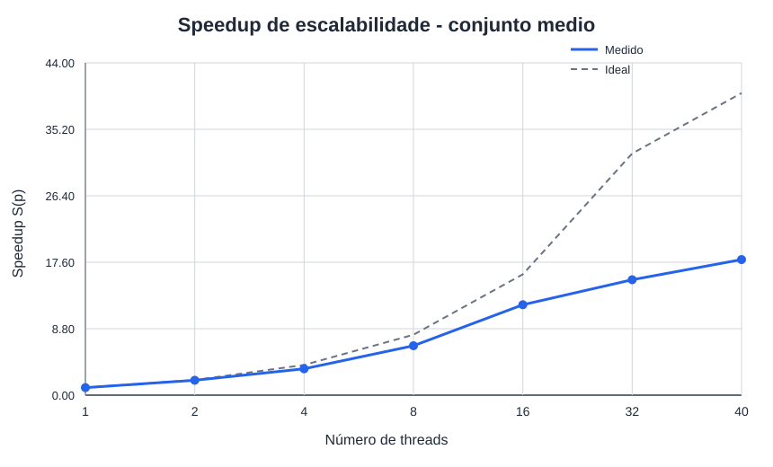
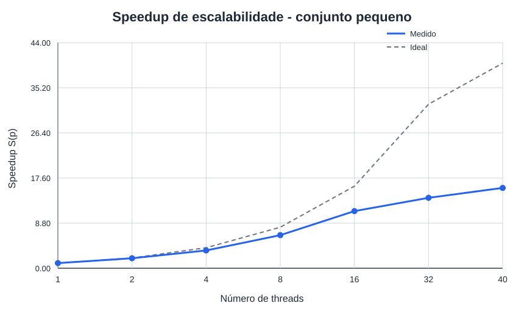

# Resultados dos experimentos na Hype

Gerado automaticamente em `2026-09-27T19:06:20-03:00`.

## Como ler este documento

Este relatório organiza as evidências já coletadas. Ele não executa o AG, não altera CSVs e não infere causas de desempenho. Use os links para voltar aos dados brutos antes de redigir a análise ou os slides.

## Inventário da coleta

- Tempos brutos: [dados/tempos.csv](dados/tempos.csv).
- Resumo de medianas: [dados/resumo.csv](dados/resumo.csv).
- Registros de ambiente: [dados/tempos_ambiente.md](dados/tempos_ambiente.md).

## Ambiente de execução

Resumo baseado em [dados/tempos_ambiente.md](dados/tempos_ambiente.md).

| Campo | Valor |
| --- | --- |
| Data e hora | `2026-09-27T18:55:06-03:00` |
| Host | `hype5` |
| Sistema operacional | Debian GNU/Linux 12 (bookworm) |
| Kernel | `Linux 6.1.0-45-amd64 x86_64 GNU/Linux` |
| Modelo | Intel(R) Xeon(R) CPU E5-2650 v3 @ 2.30GHz |
| Núcleos físicos | 20 |
| CPUs lógicas totais | 40 |
| CPUs lógicas disponíveis ao processo | 40 |
| Job ID | `825309` |
| Partição | `hype` |
| Nós alocados | `hype5` |
| CPUs solicitadas no nó | `40` |
| Compilador | `gcc (Debian 12.2.0-14+deb12u1) 12.2.0` |
| Flags sequenciais | `-O2 -g -std=c11 -Wall -Wextra -Wpedantic -Iinclude` |
| Flags paralelas | `-O2 -g -std=c11 -Wall -Wextra -Wpedantic -fopenmp -Iinclude` |
| Afinidade usada pelo coletor | `OMP_DYNAMIC=FALSE`, `OMP_PROC_BIND=true`, `OMP_PLACES=cores` |
| Uptime e média de carga | ` 18:55:06 up 148 days, 18:12,  1 user,  load average: 2.21, 0.94, 0.45` |

## Configurações testadas

| Entrada | População | Bits | Gerações | Mutação | Seed |
| --- | --- | --- | --- | --- | --- |
| grande | 4000 | 2000 | 100 | 0.0005 | 42 |
| medio | 2000 | 2000 | 100 | 0.0005 | 42 |
| pequeno | 1000 | 1000 | 100 | 0.001 | 42 |

## Tempos, speedup e eficiência

`S(p) = Tpar(1) / Tpar(p)` mede a escalabilidade da versão paralela. `E(p) = S(p) / p`. `Tseq/Tpar(p)` é mostrado separadamente como comparação com a versão sequencial. Os tempos são medianas em segundos.

| Entrada | Threads | Tseq (s) | Tpar(1) (s) | Tpar(p) (s) | S(p) | E(p) | Tseq/Tpar(p) | n seq | n par |
| --- | --- | --- | --- | --- | --- | --- | --- | --- | --- |
| grande | 1 | 3.569120 | 3.556776 | 3.556776 | 1.000× | 100.0% | 1.003× | 10 | 10 |
| grande | 2 | 3.569120 | 3.556776 | 1.808804 | 1.966× | 98.3% | 1.973× | 10 | 10 |
| grande | 4 | 3.569120 | 3.556776 | 1.014805 | 3.505× | 87.6% | 3.517× | 10 | 10 |
| grande | 8 | 3.569120 | 3.556776 | 0.541892 | 6.564× | 82.0% | 6.586× | 10 | 10 |
| grande | 16 | 3.569120 | 3.556776 | 0.293830 | 12.105× | 75.7% | 12.147× | 10 | 10 |
| grande | 32 | 3.569120 | 3.556776 | 0.227307 | 15.647× | 48.9% | 15.702× | 10 | 10 |
| grande | 40 | 3.569120 | 3.556776 | 0.191392 | 18.584× | 46.5% | 18.648× | 10 | 10 |
| medio | 1 | 1.791319 | 1.779082 | 1.779082 | 1.000× | 100.0% | 1.007× | 10 | 10 |
| medio | 2 | 1.791319 | 1.779082 | 0.902980 | 1.970× | 98.5% | 1.984× | 10 | 10 |
| medio | 4 | 1.791319 | 1.779082 | 0.509783 | 3.490× | 87.2% | 3.514× | 10 | 10 |
| medio | 8 | 1.791319 | 1.779082 | 0.271790 | 6.546× | 81.8% | 6.591× | 10 | 10 |
| medio | 16 | 1.791319 | 1.779082 | 0.148606 | 11.972× | 74.8% | 12.054× | 10 | 10 |
| medio | 32 | 1.791319 | 1.779082 | 0.116418 | 15.282× | 47.8% | 15.387× | 10 | 10 |
| medio | 40 | 1.791319 | 1.779082 | 0.099093 | 17.954× | 44.9% | 18.077× | 10 | 10 |
| pequeno | 1 | 0.463673 | 0.447999 | 0.447999 | 1.000× | 100.0% | 1.035× | 10 | 10 |
| pequeno | 2 | 0.463673 | 0.447999 | 0.230315 | 1.945× | 97.3% | 2.013× | 10 | 10 |
| pequeno | 4 | 0.463673 | 0.447999 | 0.129175 | 3.468× | 86.7% | 3.589× | 10 | 10 |
| pequeno | 8 | 0.463673 | 0.447999 | 0.069422 | 6.453× | 80.7% | 6.679× | 10 | 10 |
| pequeno | 16 | 0.463673 | 0.447999 | 0.040197 | 11.145× | 69.7% | 11.535× | 10 | 10 |
| pequeno | 32 | 0.463673 | 0.447999 | 0.032611 | 13.738× | 42.9% | 14.219× | 10 | 10 |
| pequeno | 40 | 0.463673 | 0.447999 | 0.028592 | 15.668× | 39.2% | 16.217× | 10 | 10 |

### Destaques numéricos

- `grande`: maior speedup observado foi 18.584× com `p=40` (eficiência 46.5%).
- `medio`: maior speedup observado foi 17.954× com `p=40` (eficiência 44.9%).
- `pequeno`: maior speedup observado foi 15.668× com `p=40` (eficiência 39.2%).

## Integridade observada

Foram lidas 240 execuções brutas (`paralelizado`: 210, `sequencial`: 30).

A tabela confere se todas as repetições de uma mesma configuração registraram o mesmo melhor fitness. `DIVERGENTE` deve ser investigado antes de usar uma curva como comparação de desempenho.

| Configuração | Linhas | Versões | Fitness observado |
| --- | --- | --- | --- |
| entrada=grande, P=4000, B=2000, G=100, μ=0.0005, seed=42 | 80 | paralelizado, sequencial | 1575 (consistente) |
| entrada=medio, P=2000, B=2000, G=100, μ=0.0005, seed=42 | 80 | paralelizado, sequencial | 1522 (consistente) |
| entrada=pequeno, P=1000, B=1000, G=100, μ=0.001, seed=42 | 80 | paralelizado, sequencial | 847 (consistente) |

## Gráficos gerados

As figuras abaixo são as evidências visuais produzidas pela automação. Os valores numéricos de referência permanecem na tabela e no CSV acima.

### Eficiencia grande

[Eficiencia grande](graficos/eficiencia_grande.svg)



### Eficiencia medio

[Eficiencia medio](graficos/eficiencia_medio.svg)



### Eficiencia pequeno

[Eficiencia pequeno](graficos/eficiencia_pequeno.svg)



### Speedup grande

[Speedup grande](graficos/speedup_grande.svg)



### Speedup medio

[Speedup medio](graficos/speedup_medio.svg)



### Speedup pequeno

[Speedup pequeno](graficos/speedup_pequeno.svg)




## Evidências do Intel VTune Profiler

Cada bloco preserva os artefatos coletados para uma execução. Os trechos são apenas um índice de leitura: consulte o arquivo completo e compare com os tempos sem instrumentação antes de interpretar uma causa.

### `20260917_150435_grande_p8_g500`

**Coleta sem perfil utilizável.** O VTune registrou um erro antes de produzir relatórios de desempenho. Não use este diretório para atribuir hotspots ou causas à curva de speedup.

- [vtune/resultados/20260917_150435_grande_p8_g500/hotspots-bad/data.0/pinerr.tpsslog](vtune/resultados/20260917_150435_grande_p8_g500/hotspots-bad/data.0/pinerr.tpsslog): `Source/pin/elfio/img_elf.cpp: ProcessSectionHeaders: 927: unknown section type 0x13 for sec[51,.relr.dyn] in /lib64/ld-linux-x86-64.so.2`

Arquivos disponíveis: [vtune/resultados/20260917_150435_grande_p8_g500/metadados.md](vtune/resultados/20260917_150435_grande_p8_g500/metadados.md), [vtune/resultados/20260917_150435_grande_p8_g500/ambiente.md](vtune/resultados/20260917_150435_grande_p8_g500/ambiente.md).

### `20260927_185651_grande_p8_g500`

**Coleta sem perfil utilizável.** O VTune registrou um erro antes de produzir relatórios de desempenho. Não use este diretório para atribuir hotspots ou causas à curva de speedup.

- [vtune/resultados/20260927_185651_grande_p8_g500/hotspots-bad/data.0/pinerr.tpsslog](vtune/resultados/20260927_185651_grande_p8_g500/hotspots-bad/data.0/pinerr.tpsslog): `Source/pin/elfio/img_elf.cpp: ProcessSectionHeaders: 927: unknown section type 0x13 for sec[51,.relr.dyn] in /lib64/ld-linux-x86-64.so.2`

Arquivos disponíveis: [vtune/resultados/20260927_185651_grande_p8_g500/metadados.md](vtune/resultados/20260927_185651_grande_p8_g500/metadados.md), [vtune/resultados/20260927_185651_grande_p8_g500/ambiente.md](vtune/resultados/20260927_185651_grande_p8_g500/ambiente.md).

### `20260927_190222_grande_p8_g500`

Arquivos disponíveis: [vtune/resultados/20260927_190222_grande_p8_g500/metadados.md](vtune/resultados/20260927_190222_grande_p8_g500/metadados.md), [vtune/resultados/20260927_190222_grande_p8_g500/ambiente.md](vtune/resultados/20260927_190222_grande_p8_g500/ambiente.md), [vtune/resultados/20260927_190222_grande_p8_g500/hpc/resumo.txt](vtune/resultados/20260927_190222_grande_p8_g500/hpc/resumo.txt).

<details><summary>Trecho de [vtune/resultados/20260927_190222_grande_p8_g500/hpc/resumo.txt](vtune/resultados/20260927_190222_grande_p8_g500/hpc/resumo.txt)</summary>

```text
Elapsed Time: 2.646s
    CPI Rate: 0.370
    Average CPU Frequency: 2.596 GHz
    Total Thread Count: 8
Effective Physical Core Utilization: 38.7% (7.740 out of 20)
 | The metric value is low, which may signal a poor physical CPU cores
 | utilization caused by:
 |     - load imbalance
 |     - threading runtime overhead
 |     - contended synchronization
 |     - thread/process underutilization
 |     - incorrect affinity that utilizes logical cores instead of physical
 |       cores
 | Explore sub-metrics to estimate the efficiency of MPI and OpenMP parallelism
 | or run the Locks and Waits analysis to identify parallel bottlenecks for
 | other parallel runtimes.
 |
    Effective Logical Core Utilization: 19.2% (7.682 out of 40)
     | The metric value is low, which may signal a poor logical CPU cores
     | utilization. Consider improving physical core utilization as the first
     | step and then look at opportunities to utilize logical cores, which in
     | some cases can improve processor throughput and overall performance of
     | multi-threaded applications.
     |
[trecho interrompido; consulte o arquivo completo]
```

</details>

### `20260927_190537_grande_p20_g500`

Arquivos disponíveis: [vtune/resultados/20260927_190537_grande_p20_g500/metadados.md](vtune/resultados/20260927_190537_grande_p20_g500/metadados.md), [vtune/resultados/20260927_190537_grande_p20_g500/ambiente.md](vtune/resultados/20260927_190537_grande_p20_g500/ambiente.md), [vtune/resultados/20260927_190537_grande_p20_g500/hpc/resumo.txt](vtune/resultados/20260927_190537_grande_p20_g500/hpc/resumo.txt).

<details><summary>Trecho de [vtune/resultados/20260927_190537_grande_p20_g500/hpc/resumo.txt](vtune/resultados/20260927_190537_grande_p20_g500/hpc/resumo.txt)</summary>

```text
Elapsed Time: 1.159s
    CPI Rate: 0.384
    Average CPU Frequency: 2.597 GHz
    Total Thread Count: 20
Effective Physical Core Utilization: 91.7% (18.345 out of 20)
    Effective Logical Core Utilization: 44.7% (17.870 out of 40)
     | The metric value is low, which may signal a poor utilization of logical
     | CPU cores while the utilization of physical cores is acceptable. Consider
     | using logical cores, which in some cases can improve processor throughput
     | and overall performance of multi-threaded applications.
     |
Memory Bound: 1.5% of Pipeline Slots
    Cache Bound: 1.6% of Clockticks
    DRAM Bound: N/A with HT on
        DRAM Bandwidth Bound: 0.0% of Elapsed Time
    NUMA: % of Remote Accesses: 0.0%
    Bandwidth Utilization
    Bandwidth Domain             Platform Maximum  Observed Maximum  Average  % of Elapsed Time with High BW Utilization(%)
    ---------------------------  ----------------  ----------------  -------  ---------------------------------------------
    DRAM, GB/sec                 118                          9.400    5.593                                           0.0%
    DRAM Single-Package, GB/sec  59                           6.300    3.729                                           0.0%
Collection and Platform Info
    Application Command Line: /home/users/phffleck/trabalho-1-openmp/ga_seq_paralelizado/ga_seq_paralelizado "4000" "2000" "500" "0.0005" "42"
    Operating System: 6.1.0-45-amd64 12.15
[trecho interrompido; consulte o arquivo completo]
```

</details>


## Roteiro para a análise crítica e os slides

- Compare apenas pontos do mesmo ambiente e da mesma configuração de entrada.
- Explique a tendência de `S(p)` e `E(p)` ao aumentar `p`, usando tempos, topologia da máquina e a carga registrada como evidências.
- Discuta separadamente `Tseq/Tpar(p)` e o speedup de escalabilidade `S(p)`, pois as referências são diferentes.
- Se houver VTune, relacione hotspots, sincronização e métricas de memória com uma observação específica das curvas, sem tratar o tempo instrumentado como referência.
- Registre limitações: tamanho do problema, repetições, afinidade, carga concorrente e possíveis pontos com fitness divergente.

## Como atualizar

Após uma nova coleta, gere novamente `dados/resumo.csv` e os gráficos. Em seguida, execute o script de relatório desta pasta para sobrescrever somente este Markdown.
